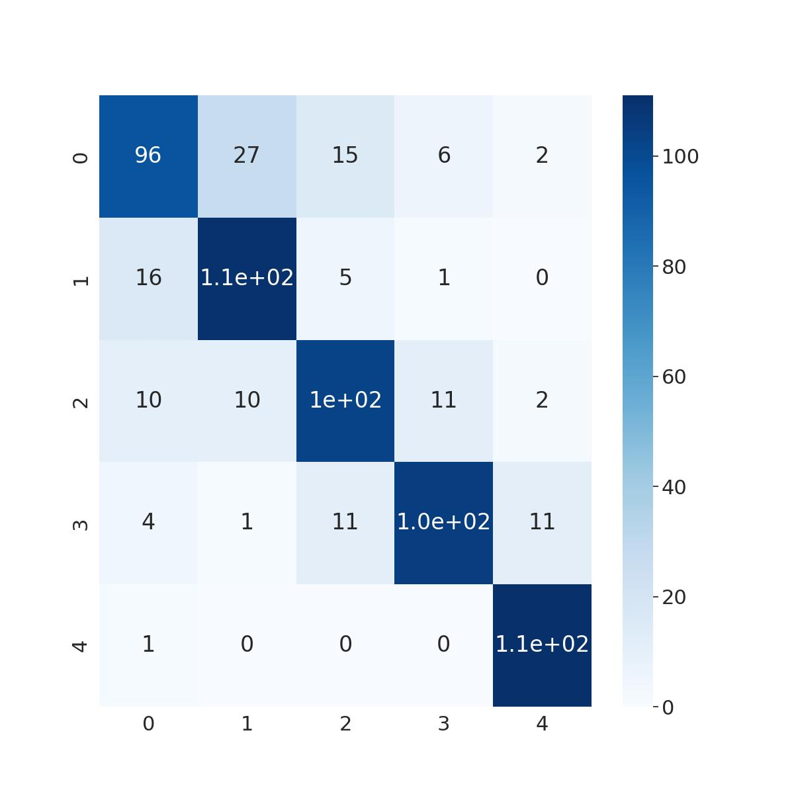

# Resumen de los entrenamientos
Los entrenamientos fueron realizados por super computadoras de CEDIA. En total se han solicitado 10 instancias, de las cuales 5 fueron para lso entrenamientos para el modelo basado en transformers y los restantes para el modelo basado en convolución.

## Recursos
Indistintamente del modelo, las especificaciones de las instancias siempre fueros las siguientes:
- 12 núcleos de CPU
- 64 GB de RAM
- 1 GPU NVIDIA A100 de 40 GB de memoria

## Modelo basado en transformers
La arquitectura se compone de los siguiente:

> Note: projection_dim = 256, patch_size = 10, num_patch = 361

- Encoder:
  - Primera Capa de convolución 3D. Filtros projection_dim * 8 Kernel = patch_size, stride = patch_size, padding = 'same', Activation = 'relu'
  - Segunda Capa de convolución 3D. Filtros projection_dim * 4 Kernel = patch_size, stride = patch_size, padding = 'same', Activation = 'relu'
  - Tercera Capa de convolución 3D. Filtros projection_dim * 2 Kernel = patch_size, stride = patch_size, padding = 'same', Activation = 'relu'
  - Cuarta Capa de convolución 3D.  Filtros projection_dim * 1 Kernel = patch_size, stride = patch_size, padding = 'same', Activation = 'relu'
  - Codificación posicional de los patches creados por las capas anteriores
  - 18 capas de transformadores con las siguientes especificaciones:
    - 4 cabezas
    - 256 projection_dim
    - MLP de cada transformer con dos capas densas de 512 y 256 neuronas con activación gelu y dropout de 0.15
- Decoder:
  - Concatenación de las salidas intermedias (3, 6, 9, 12, 15, 18) de los transformadores
  - Batch Normalization
  - MLP de una capa con 128 neuronas y activación relu
  - Capa densa clasificadora con N neuronas (N = número de clases)

### Resultados de los entrenamientos
train_loss: 0.26158565282821655
train_acc: 0.8915525078773499
val_loss: 0.5042849779129028
val_acc: 0.7978723645210266

## Modelo basado en convolución

<DESCRIBIR_EL_MODELO>