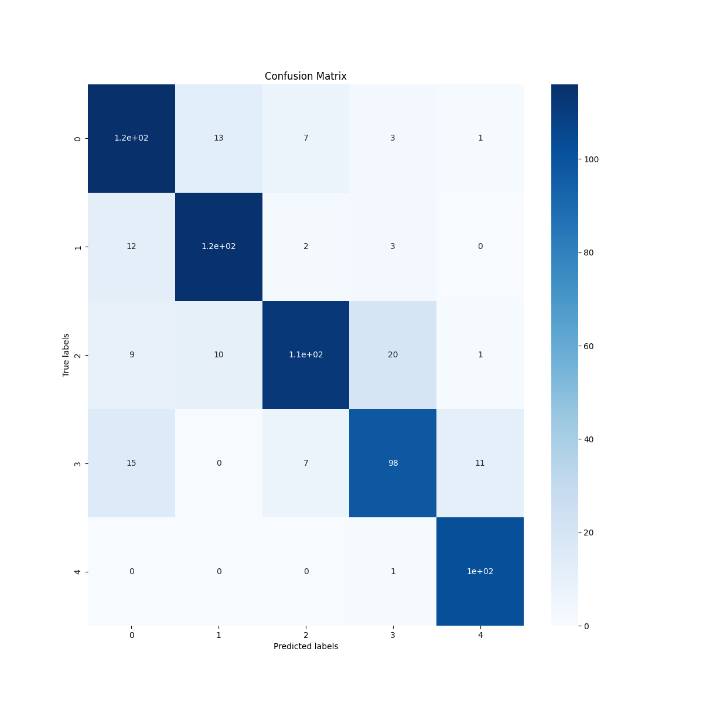

# Resumen de los entrenamientos
Los entrenamientos fueron realizados por super computadoras de CEDIA. En total se han solicitado 10 instancias, de las cuales 5 fueron para lso entrenamientos para el modelo basado en transformers y los restantes para el modelo basado en convolución.

## Recursos
Indistintamente del modelo, las especificaciones de las instancias siempre fueros las siguientes:
- 12 núcleos de CPU
- 64 GB de RAM
- 1 GPU NVIDIA A100 de 40 GB de memoria

## Modelo basado en transformers
La arquitectura se compone de los siguiente:

> Note: **projection_dim** = 256, **patch_size** = 10, **num_patch** = 361

- Encoder:
  - Primera Capa de convolución 3D. Filtros projection_dim * 8, Kernel = patch_size, stride = patch_size, padding = 'same', Activation = 'relu'
  - Segunda Capa de convolución 3D. Filtros projection_dim * 4, Kernel = patch_size, stride = patch_size, padding = 'same', Activation = 'relu'
  - Tercera Capa de convolución 3D. Filtros projection_dim * 2, Kernel = patch_size, stride = patch_size, padding = 'same', Activation = 'relu'
  - Cuarta Capa de convolución 3D.  Filtros projection_dim * 1, Kernel = patch_size, stride = patch_size, padding = 'same', Activation = 'relu'
  - Codificación posicional de los patches creados por las capas anteriores
  - 18 capas de transformadores con las siguientes especificaciones:
    - 4 cabezas
    - 256 projection_dim
    - MLP de cada transformer con dos capas densas de 512 y 256 neuronas con activación gelu y dropout de 0.15
- Decoder:
  - Concatenación de las salidas intermedias (3, 6, 9, 12, 15, 18) de los transformadores
  - Batch Normalization
  - MLP de una capa con 128 neuronas y activación relu
  - Capa densa clasificadora con N neuronas (N = número de clases)

### Resultados de los entrenamientos
```
train_loss: 0.26158565282821655
train_acc: 0.8915525078773499
val_loss: 0.5042849779129028
val_acc: 0.7978723645210266
```


## Modelo basado en convolución

Se compone de 20 capas compuestos de bloques llamados ResBlock, seguidos al final de una capa de AveragePool3D y una MLP de 3 capas con 55296, 256 y 256 neuronas respectivamente.

Del bloque ResBlock existen dos tipo cuya unica diferencia son las 2 primeras capas, las cuales se distinguen a continuación:

- Tipo Downsample:
  - Una capa de Convolucion 3D de kernel 1x1x1, stride 2x2x2, padding 0 y la cantidad de filtros es parametrizada en cada capa (se describe mas adelante).
  - Una capa BatchNormalization3D, a esta salida la llamaremos shortcut.
  - Una capa de Convolucion 3D de kernel 3x3x3, stride 2x2x2, padding 1 y la cantidad de filtros es parametrizada en cada capa (se describe mas adelante).
  - Una capa BatchNormalization3D
  - Una capa ReLU
  - Una capa Convolucion 3D de kernel 3x3x3, stride 1x1x1, padding 1x1x1 y la cantidad de filtros es parametrizada en cada capa (se describe mas adelante).
  - Una capa BatchNormalization3D
  - Una capa ReLU
  - Se suma la salida de la capa anterior con el valor guardado en la variable shortcut.
  - Una capa ReLU
  
- Tipo Upsample (el input de esta capa se lo conocera directamente como shortcut):
  - Una capa Convolucion 3D de kernel 3x3x3, stride 1x1x1, padding 1 y la cantidad de filtros es parametrizada en cada capa (se describe mas adelante).
  - Una capa BatchNormalization3D
  - Una capa ReLU
  - Una capa Convolucion 3D de kernel 3x3x3, stride 1x1x1, padding 1 y la cantidad de filtros es parametrizada en cada capa (se describe mas adelante).
  - Una capa BatchNormalization3D
  - Una capa ReLU
  - Se suma la salida de la capa anterior con el valor guardado en la variable shortcut.
  - Una capa ReLU

Se agruparan las capas para una mejor comprensión de la arquitectura:

1. Capa 1: Convolucion 3D de kernel 3x3x3, stride 1x1x1, padding 1 y 32 filtros, MaxPool3D de kernel 2x2x2, stride 1x1x1, padding 1. BatchNormalization3D y ReLU.
2. Capa 2: Conformada por dos ResBlock de tipo UpSample con 32 filtros.
3. Capa 3: Conformada por dos ResBlock de tipo UpSample con 32 filtros.
4. Capa 4: Conformada por una ResBlock de tipo DownSample con 32 filtros y otra de tipo UpSample con 32 filtros.
5. Capa 5: Conformada por dos ResBlock de tipo UpSample con 32 filtros.
6. Capa 6: Conformada por dos ResBlock de tipo UpSample con 32 filtros.
7. Capa 7: Conformada por una ResBlock de tipo DownSample con 32 filtros y otra de tipo UpSample con 32 filtros.
8. Capa 8: Conformada por dos ResBlock de tipo UpSample con 32 filtros.
9. Capa 9: Conformada por dos ResBlock de tipo UpSample con 32 filtros.
10. Capa 10: Conformada por una ResBlock de tipo DownSample con 32 filtros y otra de tipo UpSample con 32 filtros.
11. Capa 11: Conformada por dos ResBlock de tipo UpSample con 32 filtros.
12. Capa 12: AveragePool3D
13. Capa 13: Linear con 256 neuronas
14. Capa 14: Linear con 256 neuronas
15. Capa 15: Linear con neuronas = número de clases


### Resultados de los entrenamientos
```
Best Epoch: 99
Best train loss: 1.1192
Best test loss: 1.3018
Best train accuracy: 0.7839
Best test accuracy: 0.5971
```


